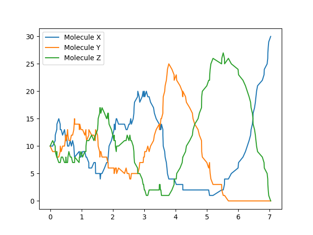
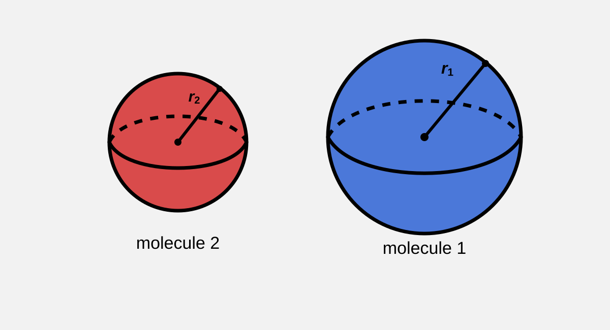
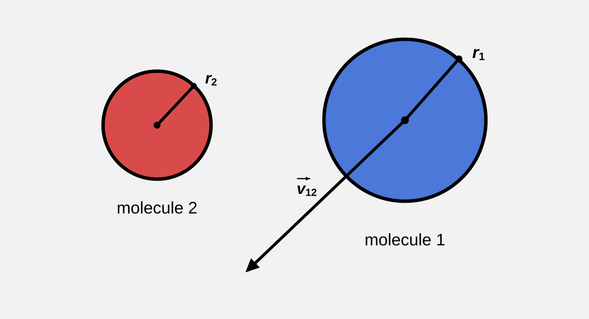
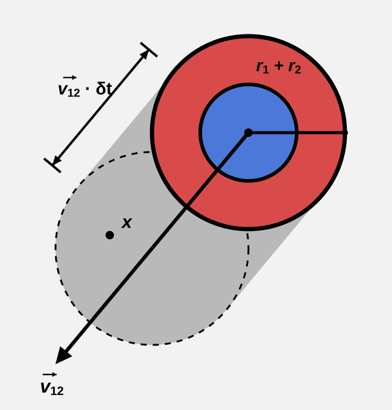
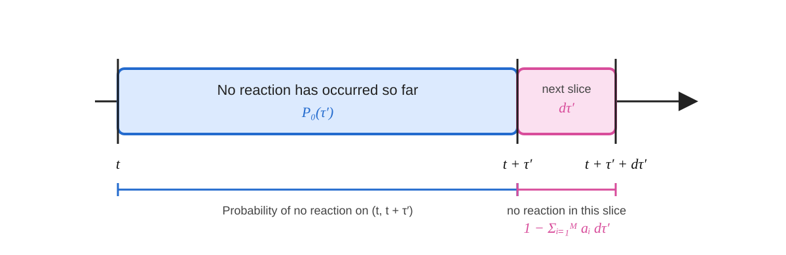

---
header-includes:
  - |
    <script>
    window.MathJax = {
      tex: {
        macros: {
          vec: ["\\overrightarrow{#1}", 1]
        }
      }
    };
    </script>
---

<style>
body {
  max-width: 800px;
  margin: 0 auto;
  padding: 2rem 4vw;
}

.sidenote {
  background-color: rgb(230, 230, 230);
  border-radius: 8px;
  padding: 0.75rem 1rem;
  margin: 1rem 0;

  font-size: 1rem;
  line-height: 1.5;
}

.sidenote summary {
  font-weight: bold;
  font-size: 1rem;
  line-height: 1.4;
  cursor: pointer;
}

.sidenote mjx-container {
  font-size: 100% !important;
}

img {
  display: block;
  max-width: 500px;
  width: 100%;
  height: auto;
  margin: 1rem auto;
}
</style>

# Understanding the Gillespie Algorithm

By Maxim Khanov

## Preface

This article is an attempt to understand the Gillespie algorithm. It closely follows Daniel Gillespie's original 1977 paper (which I highly recommend [reading](https://pubs.acs.org/jpchax/article-abstract/81/25/2340/1113608/Exact-stochastic-simulation-of-coupled-chemical?redirectedFrom=fulltext)), *Exact Stochastic Simulation of Coupled Chemical Reactions*, while occasionally slowing down to fill in mathematical details that are treated more quickly in the original presentation.

Along the way, we will also take a few historical detours to understand where the problem came from, connect the stochastic formulation back to classical chemical kinetics, and implement a simulator to see the consequences of the theory directly.

The goal is not merely to present the steps of the algorithm, but to understand why those steps take the form that they do: where the stochastic reaction model comes from, why reaction waiting times are exponentially distributed, why reactions are selected according to their propensities, and why stochastic and deterministic descriptions of the same reaction network can sometimes behave very differently.

I would also like to thank my twizzy (actually my twin), [A. Khanov](./thetwiz.png)!

Some good music that I listened to while creating this:

<iframe data-testid="embed-iframe" style="border-radius:12px" src="https://open.spotify.com/embed/track/3brfhVrVESFlfqE1IdlFdp" width="100%" height="152" frameBorder="0" allowfullscreen="" allow="autoplay; clipboard-write; encrypted-media; fullscreen; picture-in-picture" loading="lazy"></iframe>

<iframe data-testid="embed-iframe" style="border-radius:12px" src="https://open.spotify.com/embed/track/6PaSWxmwWYH2UzXwwuvgOA" width="100%" height="152" frameBorder="0" allowfullscreen="" allow="autoplay; clipboard-write; encrypted-media; fullscreen; picture-in-picture" loading="lazy"></iframe>

## Introduction

<!-- History -->
In the mid-19th century, [Ludwig Wilhelmy](https://en.wikipedia.org/wiki/Ludwig_Wilhelmy) used a differential equation to describe the time evolution of sucrose concentration during a chemical reaction, laying the mathematical foundation for what is known today as [chemical kinetics](https://en.wikipedia.org/wiki/Chemical_kinetics). This approach would later be generalized in a series of work occurring from 1864-1879 by Guldberg and Waage who developed the [law of mass action](https://en.wikipedia.org/wiki/Law_of_mass_action), which related the rate of a reaction to the concentration of its reactants. This work was further expanded in the late 1800s by Van ’t Hoff and others by clarifying that the rate of a reaction cannot be inferred directly from its chemical equation. The powers appearing in an experimentally measured rate law depend on the underlying reaction mechanism not necessarily matching the stoichiometric coefficients of the overall reaction as was thought by Guldberg and Waage. By the 20th century, systems of ordinary differential equations had become common tools for the mathematical modeling of chemical reaction systems. One usage of these newly developed tools came in 1910, when Alfred Lotka used this language of coupled differential equations to model a set of *interacting chemical reactions* and created a reaction system which demonstrated oscillating concentrations. This demonstrated that complex time-dependent behavior could emerge from networks of chemical reactions, or [chemical reaction networks](https://en.wikipedia.org/wiki/Chemical_reaction_network_theory).

By the 1970s, chemical kineticists were starting to try to study ecological and micro biological systems. Gillespie points out that in these cases fluctuations in molecule counts, ignored by ODE type models, could become important to the system’s behavior.

To understand why this might be a problem, it is important to recognize that an assumption built into using systems of ODEs to model chemical reactions is that concentrations are considered continuous quantities. However, in a fixed volume, the underlying molecule counts are discrete integers implying that the concentrations themselves are also discrete in nature. When molecule counts are large, this discreteness is usually negligible. At low molecule counts, the non continuous nature of molecule counts may become important. For example, a solution to an ODE based model may have molecule counts that pass through, for example, 1.4 and 0.4 molecules. Physically, the system does not contain fractional population. This distinction can determine whether a reaction can occur at all. The Lotka reaction from earlier is a particularly useful example. In its deterministic description, the species can oscillate smoothly. However, in the stochastic description, fluctuations can push one species to a molecule count of exactly zero. If this occurs, the reaction pathway becomes unavailable and the oscillations terminate. Thus, under small molecule counts, the behavior of reaction networks can fundamentally change.



Importantly, this isn’t just an adversarial case meant to poke holes in a mathematical model. Microscopic biological reactions often occur in small volumes. For a species at a fixed concentration, we know that $X=CVN_A$ where $X$ represents number of molecules, $C$ is the molar concentration, $V$ is the reaction volume, and $N_A$ is Avogadro’s constant. As the reaction volume becomes smaller, the same concentration corresponds to a smaller molecule count, meaning that at sufficiently small volumes, for fixed concentrations, the system can enter a critically low molecule count regime where the discreteness affects the behavior of the reaction network. Importantly, even without holding concentration constant, molecules occupy a finite volume, meaning there is an upper limit of how many molecules can physically fit within a given reaction volume. Consequently, if the reaction volume becomes sufficiently small, the system may enter this low molecule count regime simply due to this physical packing limit (however, due to some problems relating to the system being sufficiently random, Gillespie’s algorithm may not be accurate, refer to the section called “Careful Treatment of Collisions").

## Deriving the Stochastic Reaction Model

Gillespie begins by recognizing that the collisions between molecules ultimately give rise to chemical reactions. Gillespie therefore starts with a simpler question: given two molecules moving through space, what determines whether they will collide within a short interval of time?

To simplify the problem and make it geometrically tractable, Gillespie idealizes the molecules as hard spheres with radii $r_1$ and $r_2$



We also suppose that, over a sufficiently small time interval $\delta t$, the motion of the two molecules relative to one another can be treated as approximately linear. Let $\vec{v_{12}}$ denote their relative velocity.


*note: keep in mind these are 2d cross sections of the molecules*

Now note that for two spheres to collide or intersect, the center of one sphere must come within a distance of $r_1+r_2$ of the center of the other. Equivalently, we can imagine replacing one molecule by a sphere of radius $r_1+r_2$ centered at its position. Then a collision occurs whenever the center of the other molecule enters this sphere.

As the molecules move relative to one another over an infinitesimal interval $\delta t$, the collision sphere sweeps out a volume through space shaped like a pill or capsule. The newly swept volume contains exactly those positions for the center of the second molecule that would result in a collision during the time interval.



*note: again keep in mind these are 2d cross sections of the molecules, this gray shaded area is actually “pill" shaped*

The volume swept by the collision sphere can be calculated geometrically.

Let $r_{12}=r_1+r_2$ (the radius of the collision sphere) and $L=\lVert \vec{v}_{12} \rVert \delta t$ (the length of the region swept out over $\delta t$).

The swept region is a pill or capsule consisting of a cylinder of radius $r_{12}$ and length $L$, together with two hemispherical caps which combine to form a sphere. Its total volume is therefore $V_{\text{capsule}}=\pi r_{12}^2L+\frac{4}{3}\pi r_{12}^3$.

However, we want to count new collisions that occur during $\delta t$. We therefore subtract the volume of this initial sphere from the capsule. The volume of the initial sphere exactly cancels the spherical end caps giving us a swept collision volume of $\delta V_{\text{collision}}=\pi r_{12}^2L$

Now, we could theoretically keep track of each molecule’s exact position and determine whether they collide by checking if the second molecule lies inside of the collision volume. However, we would like to avoid keeping track of the microscopic positions of every molecule.

Instead, if we assume that the system is in thermal equilibrium, then the molecules are randomly and uniformly distributed throughout the reaction volume $V$. Consequently, the probability that the center of the second molecule lies within the collision volume is simply the fraction of the total reaction volume that is occupied by the collision volume:

$P(\text{molecules 1 and 2 collide over time interval } \delta t \mid \vec{v}_{12}) = \delta V_{\text{collision}}/{V}$

Or in English: “the probability of two molecules colliding over time interval $\delta t$ given that their relative velocity is $\vec{v}_{12}$ is the fraction collision volume swept over time $\delta t$ versus the entire reaction volume."

Substituting our derived value of $\delta V_{\text{collision}}$, and after that our derived value of $L$:

$P(\text{molecules 1 and 2 collide over time interval } \delta t \mid \vec{v}_{12}) =V^{-1}\pi r_{12}^2 \lVert \vec{v}_{12} \rVert \delta t$

However, different molecule pairs will generally have different relative velocities and we want to avoid keeping track them. We can therefore marginalize out the velocities:

$\begin{aligned}
P(\text{molecules 1 and 2 collide over time interval } \delta t)
&=
\mathbb{E}_{\vec{v}_{12}}
\left[
P(\text{collision during } \delta t \mid \vec{v}_{12})
\right] \\
&=
\mathbb{E}_{\vec{v}_{12}}
\left[
V^{-1}\pi r_{12}^2
\lVert \vec{v}_{12} \rVert
\delta t
\right].
\end{aligned}$

Since every other term is constant, we can replace $\lVert \vec{v}_{12} \rVert$ with its average value:

$P(\text{molecules 1 and 2 collide over time interval } \delta t)=
V^{-1}\pi r_{12}^2
\mathbb{E}\left[\lVert \vec{v}_{12}\rVert\right]
\delta t$

<details class="sidenote">
<summary>The distribution of $\lVert \vec{v}_{12} \rVert$</summary>
  
Gillespie comments that the distribution of $\lVert \vec{v}_{12} \rVert$ is a Maxwellian velocity distribution and has a well known average of:

$\mathbb{E}\left[\lVert \vec{v}_{12}\rVert\right]=\sqrt{\frac{8kT}{\pi m_{12}}}$

Where $m_{12}$ is the reduced mass:

$m_{12}=\frac{m_1m_2}{m_1+m_2}$
</details>

If there are $X_1$ molecules of species $S_1$ and $X_2$ molecules of species $S_2$, meaning there are $X_1X_2$ pairs which can interact. Then the probability that within our $\delta t$ time slice there would be a collision to leading order is:

$P(\text{any molecule pair colliding in } \delta t)=X_1X_2V^{-1}\pi r_{12}^2
\mathbb{E}\left[\lVert \vec{v}_{12}\rVert\right]
\delta t$

<details class="sidenote">

<summary>Careful Treatment of Collisions</summary>

The intuition above is that we want to find the probability up to the leading order $O(\delta t)$ and higher order terms such as $O(\delta t^2)$ are negligible and will limit out later.

As is obvious from the form of the result, the rough shape is a union bound type argument:

Let $E_{i,j}$ be the event meaning that molecule $i$ of species $S_1$ collides with molecule $j$ of species $S_2$ during $\delta t$. Applying the union bound:

$\displaystyle P(\bigcup_{i\in S_1,j\in S_2}E_{i,j})\leq\sum_{i\in S_1, j\in S_2} P(E_{i,j})$

Next using the first Bonferroni inequality, gives us a lower bound:

$\displaystyle\sum_{i\in S_1, j\in S_2} P(E_{i,j}) -{\color{orange}{\sum_{\alpha<\beta}P(E_\alpha\cap E_\beta)}}\leq P(\bigcup_{i\in S_1,j\in S_2}E_{i,j})\leq\sum_{i\in S_1, j\in S_2} P(E_{i,j})$

Conceptually we’re trying to bound the probability of a collision in the $\delta t$ time, showing it doesn’t stray too far from the union bound. The key term is highlighted in orange and represents the intersections of collisions (e.g. collisions between molecules $A-B$ and $A-C$ occur in time $\delta t$).

Examining a single term in the key sum:

$P(E_{i,j}\cap E_{k,l})=P(E_{i,j}|E_{k,l})P(E_{k,l})$

What we would want is that the next collision isn’t pathological:

$P(E_{i,j}\mid E_{k,l})=
\underbrace{\color{green}O(1)}_{\text{bounded as }\delta t\to0}
\cdot
\underbrace{O(\delta t)}_{\text{swept collision volume}}=
O(\delta t)$

Where $O(\delta t)$ comes from the volume sweeping argument from before and the green term just means that the previous collision does not introduce a term that explodes as $\delta t\to0$. Loosely speaking, the green term means that the previous collision does not reduce enough of the system's randomness to *force* another collision within the remaining time. A collision can change the dynamics within the $\delta t$ slice of time, but another collision within the same time slice must be still rare, with a probability on the order of at most $O(\delta t)$.

This condition is satisfied if the chemical system thermalizes sufficiently quickly i.e. the mixing time is much shorter than the time of a reaction occurring ($\tau_\text{mix} \ll \tau_\text{reactive collision}$). Importantly, for the Gillespie algorithm, we care about *reactive* collisions not just any ordinary collisions that don’t react. However, this is a sufficient not a necessary condition, again, we only care that the system doesn’t become pathological.

Gillespie offers some intuition why this might be the case in normal chemical systems, namely that, many collisions actually don’t result in a reaction but the molecules bounce around helping randomize their velocity, position, and other properties.

When we restrict our attention from collisions in general to collisions that actually produce a reaction, these microscopic details will be absorbed into a stochastic reaction coefficient $c$.

Since $P(E_{i,j}|E_{k,l}) = O(\delta t)$, we have that all intersection terms are on the order of $O(\delta t^2)$. Multiplying by our finite molecule counts does not change the order. Therefore by a squeeze argument we know that:

$P(\bigcup_{i\in S_1,j\in S_2}E_{i,j})=\sum_{i\in S_1, j\in S_2} P(E_{i,j})+O(\delta t^2)$

Since there are $X_1$ molecules of $S_1$ and $X_2$ molecules of $S_2$ and the collision probabilities are interchangeable, we have that:

$P(\bigcup_{i\in S_1,j\in S_2}E_{i,j})=X_1X_2 P(E_{i,j})+O(\delta t^2)$

Where $P(E_{i,j})=V^{-1}\pi r_{12}^2
\mathbb{E}\left[\lVert \vec{v}_{12}\rVert\right]
\delta t$

*note: this isn’t exactly correct since this neglects the distinction between reactive and non-reactive collisions, however, again this is to just show that it's reasonable to define some stochastic reaction coefficient and depend on molecular counts.*

Giving us: $P(\text{any molecule pair colliding in } \delta t)=X_1X_2V^{-1}\pi r_{12}^2
\mathbb{E}\left[\lVert \vec{v}_{12}\rVert\right]
\delta t+O(\delta t^2)$
</details>

So far, we have found the probability that molecules collide. However, not every collision necessarily produces a chemical reaction. Whether a collision reacts can depend on additional details such as molecular orientation, collision energy, and other physical properties of the molecules.

The key intuition to take away from this toy model is that the probability of a reaction occurring over $\delta t$ can be characterized by:

1. **The number of available reactant combinations.** More molecules means more possible molecular pairs that can undergo the reaction. For the reaction considered above, this contributes the factor $X_1X_2$.

2. **The stochastic reaction coefficient.** The microscopic details determining whether a particular reactant pair actually reacts can be summarized by a coefficient $c$, such that $c\,\delta t$ is the probability that a particular pair reacts during the next infinitesimal interval. Our toy collision model gives some physical intuition for what can be hidden inside this coefficient: temperature and molecular mass affect the distribution of relative molecular velocities, while molecular size affects the collision cross section.

Together, these give the following probabilistic model:

$P(\text{reaction between species }S_1\text{ and }S_2\text{ during }\delta t)=
{\color{blue}X_1X_2}
{\color{green}c}
{\color{orange}\delta t}$

where
${\color{blue}X_1X_2}$ is the number of available reactant combinations,
${\color{green}c}$ is the stochastic reaction coefficient,
${\color{orange}\delta t}$ is the infinitesimal time interval.

<details class="sidenote">
<summary>The Stochastic Reaction Coefficient’s Relation to the Reaction Rate Constant</summary>

Gillespie also comments on the relation between the stochastic reaction coefficient $c$ and the well known deterministic reaction rate constant $k$.

We first assume that deterministic ODE concentrations, expressed as molecule number per unit volume, correspond to the ensemble averaged concentrations:

$[S_1]=\frac{\langle X_1 \rangle}{V},[S_2]=\frac{\langle X_2 \rangle}{V}$

Then the reaction rate per unit volume is:

$\frac1V\cdot\frac{d\text{ Reactions}}{d\tau}=k[S_1][S_2]$

Giving us:

$d\text{ Reactions}=kV[S_1][S_2] d\tau$

$d\text{ Reactions}=kV\frac{\langle X_1 \rangle}{V}\frac{\langle X_2 \rangle}{V} d\tau$

Now, consider the expected number of reactions predicted by the stochastic model over the same infinitesimal interval:

$d\text{ Reactions}=X_1X_2\,c\,d\tau$

The ensemble average:

$d\text{ Reactions}=\langle X_1X_2 \rangle\,c\,d\tau$

Relating the two forms:

$\langle X_1X_2 \rangle\,c\,d\tau=kV\frac{\langle X_1 \rangle}{V}\frac{\langle X_2 \rangle}{V} d\tau$

$k=cV\frac{\langle X_1X_2 \rangle}{\langle X_1 \rangle \langle X_2 \rangle}$

Note that $\langle X_1X_2 \rangle=\langle X_1 \rangle \langle X_2 \rangle+\text{Cov}(X_1, X_2)$

The deterministic model neglects the correlations between the two random variables:

$\langle X_1X_2 \rangle\approx\langle X_1 \rangle \langle X_2 \rangle$

$k\approx cV$

After correcting between a concentration based reaction rate per unit volume and a molecule count based reaction probability over the entire volume, the two coefficients differ only by a factor of $V$ for this bimolecular reaction, assuming the covariance is negligible.

Gillespie also notes an additional combinatorial correction when a reaction requires multiple molecules of the same species. For example, for a reaction of the form

$2S_1 \rightarrow \cdots$

the number of distinct reactant pairs is not $X_1^2$, but

$\binom{X_1}{2}=\frac{X_1(X_1-1)}{2}$

Meaning that when translating between stochastic and deterministic reaction coefficients, additional combinatorial factorial factors can appear for repeated reactants. Gillespie notes that two identical reactants introduce a factor of $2!$, three identical reactants a factor of $3!$, and so on.

</details>

More generally, we should understand $c\,\delta t$ as an *average probability* that a particular combination of reactant molecules reacts during the next infinitesimal interval $\delta t$.

## Simulating Gillespie

<details class="sidenote">
<summary>Master Equation?</summary>

The stochastic problem can also be solved by formulating a master equation describing the time evolution of the probability distributions over the molecular counts. However, Gillespie notes that this formulation is generally very difficult to solve and many simple cases do not lend themselves to simple approximations such as keeping track of the distributions' moments.

Gillespie therefore uses a Monte Carlo based approach which we discuss below.
</details>

Gillespie then asks what we need to know to evolve the system in time?

The answer is simple:
1. When the next reaction will happen
2. And which reaction will it be

We introduce the following function $P(\tau, \mu\mid X, t)d\tau$ referred to as the “reaction probability density function” (or PDF for short) where $t$ represents the current time, $X$ is a vector with all the molecule counts, $\mu$ represents a specific reaction and the function gives us the probability (density) that the next reaction will be a $\mu$ reaction and will occur in the infinitesimal time interval $(t+\tau,t+\tau+d\tau)$.

We also introduce $h_\mu$ which is the number of distinct reactant molecule combinations in our state $X=(X_1,X_2,\dots,X_N)$, where $\mu\in\{1,\dots,M\}$. Where we have $N$ species and $M$ distinct reactions. From the previous section, our blue ${\color{blue}X_1X_2}$, corresponds to $h_1$ (assuming that was reaction number 1). 

<details class="sidenote">
<summary>Computing $h_\mu$</summary>

If reaction $\mu$ requires $\nu_{i,\mu}$ units of species $i$:

$h_\mu(X)=\prod_{i=1}^N \binom{X_i}{\nu_{i,\mu}}$

I.e. the binomial coefficient $\binom{X_i}{\nu_{i,\mu}}$ counts the number of distinct ways to choose the required $\nu_{i,\mu}$ molecules from the $X_i$ molecules of species $i$, and multiplying these terms together counts the total number of distinct combinations of reactants able to cause reaction $\mu$.

For example:

$3S_1+S_2\to S_3$

would have $h_\mu=\binom{X_1}{3}\binom{X_2}{1}=\frac16(X_1-2)(X_1-1)X_1\cdot X_2$
</details>

Next we define the propensity of reaction $\mu$ as:

$a_\mu(X)=h_\mu(X)c_\mu$

The quantity $a_\mu(X)\,d\tau$ is the probability that reaction $\mu$ occurs during the next infinitesimal interval $d\tau$, given the current state $X$. **Note that** the definition of $h_\mu$ assumes that reaction $\mu$ represents an elementary reaction channel. If the written reaction is only an overall description of several underlying reaction steps, its stoichiometric coefficients cannot generally be used to directly determine $h_\mu$. Instead, the underlying reactions must be modeled separately.

To construct $P(\tau, \mu)$, we conceptualize it in the following way: 

a. We want the probability that nothing happens during time $(t,t+\tau)$, and then 
b. the probability that the next reaction is $\mu$ and occurs during the infinitesimal interval $(t+\tau,t+\tau+d\tau)$

Let the probability that nothing happens during $(t,t+\tau)$ be $P_0(\tau)$, then we can write the entire probability that we’re interested in as:

$P(\tau, \mu)d\tau = {\color{green}P_0(\tau)}\cdot {\color{orange}a_\mu d\tau}$

Where the green part, ${\color{green}P_0(\tau)}$ is part a and the orange part, ${\color{orange}a_\mu d\tau}$, is part b.

We can define $P_0$ recursively as follows:

$P_0(\tau'+d\tau')={\color{blue}P_0(\tau')}\cdot{\color{pink}(1-\sum_{i=1}^M a_i d\tau')}$



To solve for the form of $P_0$ we can solve this recursive relation by advancing time by units of $d\tau'$:

The blue component: Probability of no reaction occurring from $(t, t+\tau')$

Pink component: Probability that no reaction occurs for this time slice (the slice from $(t+\tau',t+\tau'+d\tau')$)

Note that $a_i d\tau'$ is the probability that reaction $i$ occurs during $d\tau'$ and the entire pink term is one minus the probability that any of the $M$ reactions occur during $d\tau'$ i.e. the probability that none happen.

<details class="sidenote">
<summary>Why Can We Add the Reaction Propensities?</summary>
  
As a physicist, Gillespie glosses over a detail of the argument. Previously, we considered a union over many possible molecular collision events and argued that the intersection terms were on the order of $O(dt^2)$, so to first order the probability of the union was just the sum of the individual probabilities.

The same logic applies here, except now the union is over reaction channels rather than molecular pairs.

Let $E_\mu$ be the event that reaction $\mu$ occurs during $dt$. Then

$P\left(\bigcup_{\mu=1}^M E_\mu\right)=\sum_{\mu=1}^M P(E_\mu)-
\sum_{\mu<\nu}P(E_\mu\cap E_\nu)+\cdots$

From earlier we have that:

$P(E_\mu)=a_\mu dt+O(dt^2)$

For two distinct reaction channels, $E_\mu\cap E_\nu$ requires at least two reaction events to occur within the same infinitesimal interval. Gillespie assumes that the probability of more than one reaction occurring during $dt$ is higher order in $dt$, so

$P(E_\mu\cap E_\nu)=O(dt^2)$

Therefore, for a finite number of reaction channels,

$P\left(\bigcup_{\mu=1}^M E_\mu\right)=
\sum_{\mu=1}^M a_\mu dt+O(dt^2)$

So, just like we argued previously, the union becomes the sum (up to leading order).

This assumption also tells us something important about how the reaction channels must be defined. For example, suppose our reaction list accidentally contains a duplicate:

$R_1:A+B\rightarrow C$

$R_2:A+B\rightarrow C$

where $R_1$ and $R_2$ are not different mechanisms, but simply different labels for the exact same possible reaction event. In this case,

$E_1=E_2$

and therefore

$P(E_1\cap E_2)=P(E_1)=O(dt)$

rather than $O(dt^2)$. The overlap term is now first order and cannot be discarded. Simply adding $a_1dt+a_2dt$ would therefore double count the same physical event.
</details>

Now solving the recurrence gives us:

$P_0(\tau')=\exp(-\sum_{i=1}^M a_i \tau')$

Letting $a_\text{total}=\sum_{i=1}^M a_i$, a useful constant that will appear later on, we can simplify the solution to:

$P_0(\tau')=\exp(-a_\text{total} \tau')$

Note that in solving this recurrence, we assume that propensities don’t change. This is a safe assumption since propensities only change due to a change in molecule counts and since we’re finding the probability that *no reaction occurs during this waiting period* these molecule counts will not change. Strictly this is because $a_i=h_i(X)c_i$, where $c_i$ is the fixed stochastic rate constant and $h_i(X)$ is the only factor that can change as the molecule counts change. It would be more precise to write $P_0$ as a function of the form $P_0(\tau'\mid X)$ since it depends on the system state $X$.

<details class="sidenote">
<summary>How do we solve the recurrence?</summary>

We first simply note:

$P_0(0)=1$

Since the probability that no reaction has occurred in exactly zero time is one.

Then we can start by expanding the recursive definition:

$P_0(\Delta\tau)\approx P_0(0)\cdot(1-a_\text{total} \Delta\tau)$

(With the approximation becoming exact in the infinitesimal limit $\Delta\tau\to0$.)

$P_0(\Delta\tau)\approx(1-a_\text{total} \Delta\tau)$

Then for two time slices:

$P_0(2\Delta\tau)\approx(1-a_\text{total} \Delta\tau)\cdot(1-a_\text{total} \Delta\tau)=(1-a_\text{total} \Delta\tau)^2$

$n$ steps of size $\Delta\tau$:

$P_0(n\Delta\tau)\approx\prod_{i=1}^n(1-a_\text{total} \Delta\tau)=(1-a_\text{total} \Delta\tau)^n$

However, we’re interested in specifically waiting $\tau$ time and no reaction occurring, so we need to ensure that our argument $n\Delta\tau=\tau$

Solving for $\Delta\tau$, we have that:

$\Delta\tau=\frac\tau n$

We then substitute:

$P_0(n\cdot \frac\tau n)\approx(1-a_\text{total} \frac\tau n)^n$

$P_0(\tau)\approx(1-a_\text{total} \frac\tau n)^n$

Since $\Delta\tau$ should be an infinitesimal time period, we limit $n\to\infty$ (which causes $\Delta\tau\to0$):

$P_0(\tau)=\lim_{n\to\infty}(1-a_\text{total} \frac\tau n)^n$

This is a recognizable limit from calculus class (namely, the definition of $\exp$):

$P_0(\tau)=\exp(-a_\text{total}\tau)$
</details>

Finally, now that we have solved for $P_0$, we can write the entire probability that we’re interested in as:

$P(\tau, \mu)d\tau = {\color{green}P_0(\tau)}\cdot {\color{orange}a_\mu d\tau}={\color{green}\exp(-a_\text{total}\tau)}{\color{orange}a_\mu d\tau}$

To get the probability density we divide out our infinitesimal time increment $d\tau$:

$P(\tau, \mu) = \exp(-a_\text{total}\tau) a_\mu$

<details class="sidenote">
<summary>Support of the PDF</summary>
  
Technically we need to specify that $\tau\in[0,\infty)$ and that $\mu$ actually corresponds to a reaction (i.e. $\mu \in \{1,\dots,M\}$) and otherwise the probability density is zero.
</details>

### Separating the Two Questions

Now that we have the probability density, we have simultaneously answered both of our questions: how long to wait until the next reaction occurs, and which reaction occurs.

However note that the joint distribution happens to be separable!

$P(\tau,\mu)
=a_\mu e^{-a_\text{total}\tau}
={\color{blue}\left(a_\text{total}e^{-a_\text{total}\tau}\right)}
{\color{green}\left(\frac{a_\mu}{a_\text{total}}\right)}$

Note that the green term exactly represents a probability distribution over reactions $\mu$!

<details class="sidenote">

<summary>Quick Proof Green Term is a Probability Distribution</summary>

Probability distributions must satisfy two properties:
1. Summing to 1
2. All terms must be non-negative (there is no such thing as negative probability)

$\sum_\mu \frac{a_\mu}{a_\text{total}}=\frac{\sum_\mu a_\mu}{a_\text{total}}$

Note that $\sum_\mu a_\mu=a_\text{total}$, meaning

$\sum_\mu \frac{a_\mu}{a_\text{total}}=\frac{a_\text{total}}{a_\text{total}}=1$

Since all $a_\mu$ are non-negative, we have that the green term is exactly a probability distribution over reactions $\mu$.

Note that if $a_\text{total}=0$ condition 1 is not satisfied and this argument will fail. Since all propensities are non-negative, this means that all propensities have reached $0$. This intuitively means that no reaction can occur next and we should stop (the molecule counts will never change). This will also show up in the next step as an effectively infinite waiting time.

</details>

Also note that the blue term exactly represents a probability distribution over the waiting time $\tau$!

The blue term ${\color{blue}\left(a_\text{total}e^{-a_\text{total}\tau}\right)}$ is exactly a PDF of an exponential random variable with rate parameter $\lambda=a_\text{total}$:

$\tau\sim\operatorname{Exp}(a_\text{total})$

<details class="sidenote">
<summary>What Does an Exponential Distribution Represent?</summary>

The exponential distribution often appears when we want to find the distribution of times *waiting until the next occurring random event*, where events occur at some constant rate $\lambda$.

The classic example is a call center. Suppose we have an average rate of calls of $\lambda=5$ calls per hour (note the units of a rate are events per unit time). If the assumptions of our model hold, then the time until the next call, say $\tau$, can be modeled as an exponential distribution:

$\tau\sim\operatorname{Exp}(5)$

The exponential distribution also has a discrete cousin. The classic setting is to imagine repeatedly sampling a Bernoulli distributed random variable (think a coin toss) with some probability $p$ of success. We can then ask how many trials we must wait until the first success occurs. This waiting time is described by the geometric distribution.

For example, if we repeatedly flip a fair coin, the number of flips we wait until the first heads is geometrically distributed.

The connection to the exponential distribution is that instead of dividing time into discrete trials, we can divide time into increasingly small slices $\Delta t$ and limit $\Delta t\to0$. Which is exactly how we found the form of $P_0(\tau)$!

</details>

Since the joint density is separable i.e. $P(\tau,\mu)=P(\tau)P(\mu)$, we are safe to sample each random variable independently (conditional on the current molecule count $X$).

<details class="sidenote">

<summary>The Memoryless Property</summary>

One of the defining characteristics of an exponential distribution is its memorylessness.

Suppose $X\sim\operatorname{Exp}(\lambda)$, then the memoryless property is that:

$P(X>t+s\mid X>s)=P(X>t)$

In English: suppose we have already waited for $s$ units of time and nothing has happened. The memoryless property says that this does not make the event any more or less "due." The probability that we must wait at least another $t$ units of time is exactly the same as it was when we first started waiting.

This makes sense in our reaction model. While no reaction occurs, the molecule counts do not change, so the state $X$ remains the same meaning all of the reaction propensities also remain the same. The model does not keep track of something like "a reaction gradually getting closer to occurring". So, after waiting $s$ units of time without a reaction (meaning the molecule counts $X$ don’t change), the system is probabilistically in the same situation it was in when we started waiting.

This is also why the current time $t$ never makes it into any equations, since the system is fully (stochastically) determined by its molecule counts.
</details>

At this point we have everything to construct the simulator, namely, we know:

$\tau\sim\operatorname{Exp}(a_\text{total})$

And that

$P(\mu)=\frac{a_\mu}{a_\text{total}}$

## Implementing a Simulator

To implement the simulator our algorithm will have the following steps:

1. Initialize molecule counts, reaction channels, stochastic rate constants, and $t=0$
2. Update reaction propensities $a_\mu$
3. If $a_\text{total}=0$ or $t\geq T$ (where $T$ represents our simulation stop time) stop the simulation
4. Sample $\tau$
5. Sample $\mu$
6. Update molecule counts
7. Go back to step 2

```python
# import some helpful libraries
import numpy as np
from scipy.special import comb
import matplotlib.pyplot as plt

# initialize simulation states
# species: X, Y, Z

# reactions: X+Y->2Y, Y+Z->2Z, X+Z->2X
# note that this is a non-poset game (more specifically a cyclic game)
molecule_counts = np.array([10, 10, 10])

reactant_matrix = np.array([[1,1,0],
                            [0,1,1],
                            [1,0,1]])
product_matrix  = np.array([[0,2,0],
                            [0,0,2],
                            [2,0,0]])
stochastic_rate_constants = np.array([0.1,0.1,0.1])

time_max = 30
current_time = 0

# setup some variables to hold simulation snapshots:
snapshot_times = []
snapshot_molecules = []

# set up a random number generator we will use:
rng = np.random.default_rng(seed=42)

# check that the shapes of simulation parameters are consistent
assert (molecule_counts.shape[0] == reactant_matrix.shape[1]) and (molecule_counts.shape[0] == product_matrix.shape[1]),"Inconsistent number of species"

assert (stochastic_rate_constants.shape[0] == reactant_matrix.shape[0]) and (stochastic_rate_constants.shape[0] == product_matrix.shape[0]), "Inconsistent number of elementary reaction channels"

# add first state to snapshots:
snapshot_times.append(current_time)
snapshot_molecules.append(molecule_counts.copy())

while True:
  # compute reactant combinations:
  per_rc_combinations = np.prod(comb(molecule_counts, reactant_matrix), axis=1)
  # Compute RC propensities
  propensities = per_rc_combinations * stochastic_rate_constants

  total_propensity = propensities.sum()

  # check if simulation should be stopped
  if current_time >= time_max or total_propensity == 0:
    break
  
  # sample a waiting time tau:
  # note that in numpy, we need 1/total_propensity since it asks for the scale parameter (not the rate)
  tau = rng.exponential(scale=1/total_propensity)
  current_time += tau

  # sample a reaction to occur:
  reaction_probabilities = propensities / total_propensity
  reaction_idx = rng.choice(reactant_matrix.shape[0], p=reaction_probabilities)

  # update molecule counts:
  molecule_counts -= reactant_matrix[reaction_idx]
  molecule_counts += product_matrix[reaction_idx]

  snapshot_times.append(current_time)
  snapshot_molecules.append(molecule_counts.copy())

snapshot_molecules = np.array(snapshot_molecules)

molecule_names = ["X","Y","Z"]

for mol_idx in range(molecule_counts.shape[0]):
  plt.plot(snapshot_times, snapshot_molecules[:, mol_idx], label=f"Molecule {molecule_names[mol_idx]}")

plt.legend()
plt.show()
```

The simulator is set up to model the following system:

We have species $X, Y, Z$ and initially have 10 molecules of each.

The reactions form a cyclic game (similar to rock, paper, scissors) where no species dominates all others:

$X+Y\to2Y, Y+Z\to2Z, X+Z\to2X$

All stochastic reaction coefficients are also equal (set to $0.1$):


Note that in the deterministic formulation of this system, we are in equilibrium, i.e. the three reaction fluxes exactly balance and the populations would remain constant.

However, as we discussed in the beginning, the stochastic system behaves quite differently! Namely, random reaction events perturb the system away from this equilibrium and produce increasingly large oscillations. Eventually one species, in this run $Y$, reaches a molecule count of exactly zero and no reactions which require $Y$ can continue thereby breaking the loop. Once the oscillatory loop is broken the only reaction that can occur is $X+Z\to2X$ forcing the system into a state where only $X$ is left.